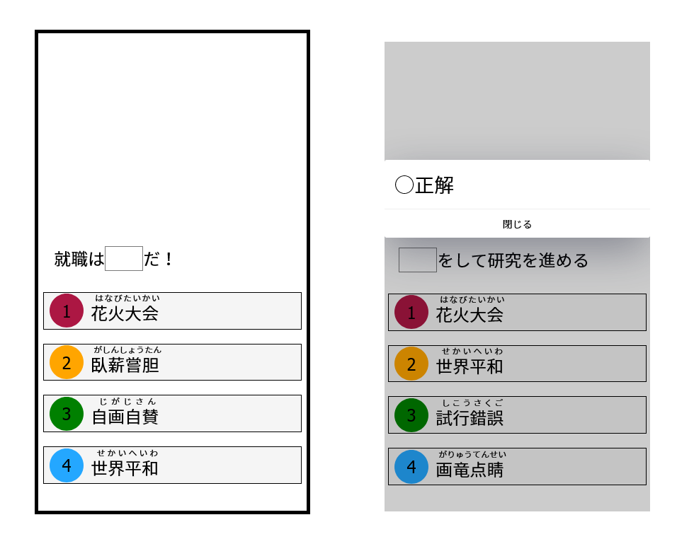

個人向けのシンプルなe-Learning システム

### 特徴
* 学習ログを取らない、時間制限も無い、本当に勉強をしたいだけの人向けのシステムです。
* ４択問題でひたすら正解を答え続け
* ユーザー次第で自由に問題を追加できます。(私はこれにSPIの問題集を入れて勉強しました)
* 設定ファイルを書くだけで暗記勉強になります！(本末転倒)




## Project setup
```bash
npm install
# Configファイルを使えるようにする
cp src/models/config_template.ts src/models/config.ts
```

### Compiles and hot-reloads for development
```
npm run serve
```

### Compiles and minifies for production
```
npm run build
```

### Lints and fixes files
```
npm run lint
```

### Config File

`src/models/config_template.ts`ファイルを`src/models/config.ts`へ書き換えて使用する

```csharp
  # 穴埋め問題：(前半、後半、答え)の順に設定する。
  public static QuizData: Quiz[] = [
    new FillInTheBlankQuiz(
      '夏休みの最終日には',
      'あるそうだ',
      new RubyString('花火大会', 'はなびたいかい')
    ),
    new FillInTheBlankQuiz('就職は', 'だ！', new RubyString('臥薪嘗胆', 'がしんしょうたん')),
    # 前半、または、後半の文字は空文字でも良い
    new FillInTheBlankQuiz('', 'をして研究を進める', new RubyString('試行錯誤', 'しこうさくご'))
  ]
  # 偽の答え：(ランダムに選択肢に挿入される)
  public static FillInTheBlankIncorrectAnswers: RubyString[] = [
    new RubyString('画竜点睛', 'がりゅうてんせい'),
    new RubyString('明鏡止水', 'めいきょうしすい'),
    new RubyString('花火大会', 'はなびたいかい'),
    new RubyString('世界平和', 'せかいへいわ '),
    new RubyString('試行錯誤', 'しこうさくご'),
    new RubyString('自画自賛', 'じがじさん')
  ]
```
